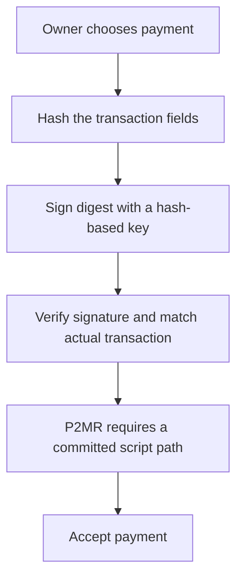

# A PQ payment without the QSB search

The runnable demo combines **P2MR + OP_TEMPLATEHASH + OP_CAT + Lamport signatures**.
It signs a full 256-bit payment digest with SHA256 preimages, without searching
for a hash that happens to be a valid classical signature. A separate modified
Bitcoin Core 31.1 interpreter checks the serialized spends against their exact
linked parent transactions. All 27 expected outcomes pass.

This is a local model of proposed Script rules. Parents are synthetic fixtures,
not mined coins; there is no node, activation, mempool, ancestry, finality, or
block validation. The original Core source and stock verifier remain separate.
SHRINCS and CISA are compared below; neither is implemented by this demo.
Follow-up experiments now implement [native SHRINCS](shrincs-demo.md),
[persistent signing state](shrincs-state.md), and [CISA/proof aggregation](aggregation-demo.md).

## What the pieces contribute

| Piece | Job in a PQ payment |
| --- | --- |
| Hash-based signature, here Lamport | Prove that the spender knows the secrets associated with the committed signing key. |
| Transaction binding, here `OP_TEMPLATEHASH` | Make that authorization apply to the actual outputs and selected transaction fields. |
| Script operations, here `OP_CAT` and `OP_SHA256` | Reconstruct the signed digest and check the hash commitments. |
| P2MR | Commit to the spending scripts without an alternative elliptic-curve key path. Every usable leaf must still enforce suitable authorization. |
| Aggregation | Potentially reduce the cost of authorizing many inputs; it needs its own compatible cryptographic scheme and validation rules. |

The owner chooses the payment at signing time. Its outputs are not fixed when
the coin is created: the script stores the signing-key commitments, reconstructs
the digest from the disclosed Lamport signature, and compares it to the
transaction's template hash. This is an application of transaction introspection
to signing; not every proposal called a covenant supplies the same capability.
The binding primitive here is specifically [BIP446 OP_TEMPLATEHASH](https://github.com/bitcoin/bips/blob/09e21036a4001fe6c9ba65c1d3a39b737768132f/bip-0446.md).



QSB achieves authorization under existing rules by using a difficult
hash-to-signature construction. This demo changes the available validation
operations so the signature can authorize the payment directly. It avoids that
specific puzzle; it does not find a shortcut through it or reproduce QSB under
unchanged rules.

## Run it

Follow the root README's Python and stock Core verifier setup first. CMake,
Ninja, a C++20 compiler and the pinned Core checkout are needed for the first
build. No new external Python packages are required by the demo.

```sh
btc-pq covenant-demo --build
btc-pq covenant-demo --replay
python -m unittest discover -s tests -v
```

The first command builds only `.cache/covenant-build/btc-pq-covenant-verify`
from an isolated source copy. Subsequent runs can omit `--build`.
Use `--outdir` for another fixture directory.

Results: [report.json](../results/covenant-demo/report.json),
[replay.json](../results/covenant-demo/replay.json), and
[pinned proposal sources](../results/covenant-demo/sources.json).
Every case stores a real transaction hex file, linked parent filenames,
expected verdict, native verdict/error, weight, and interpreter timing.
Fixtures, build inputs, the native binary and harness sources have SHA256 hashes.

## What actually passed and failed

| Construction | Original payment | Same authorization, changed recipient/amount/sequence | Alternative key spend |
| --- | --- | --- | --- |
| P2MR + unbound Lamport | Accept | **Accept: payment not bound** | No key path |
| Taproot + bound Lamport | Accept | Reject | **Known key spends without Lamport** |
| P2MR + bound Lamport | Accept | Reject | Lone 64-byte witness rejected |

The Taproot control uses a known tweaked private key and a real BIP340 signature.
It demonstrates that a separate key path exists, not that we ran Shor's algorithm.
For the combined design, modified locktime/version, wrong preimages, changed
bits, nonminimal condition bits, a bad Merkle proof, and an added annex all fail.

Two inputs with independent PQ keys pass when both signatures are supplied.
Deleting the second authorization or copying the first owner's authorization
into the second input fails. This is the executable baseline for discussing
aggregation; no aggregate-proof verifier is substituted.

Two stock-Core controls intentionally accept invalid authorization:
witness v2 is an unknown-version upgrade hook, and the proposed Taproot opcodes
are `OP_SUCCESS` under stock rules. **Those acceptances mean the new conditions
are not enforced.** They are not demonstrations of Bitcoin mainnet PQ support.

## Measurements and limits

The recorded one-input P2MR payment is **30,073 bytes / 30,355 WU / 7,589 vB**.
It contains a **21,093-byte script**, **8,192 bytes of signature preimages**,
140 bytes of bit selectors, serialization overhead and a 33-byte control block.
It uses 512 initial authorization stack elements and no `CHECKSIG` operations.
The full message and preimages are each 256 bits; this is not a claim of
256-bit quantum security. The compiler deliberately favors clarity over size.

The two-input payment is **60,078 bytes / 60,483 WU / 15,121 vB**. There is no
automatic saving across those two signatures. Signing is simple selection of
256 preimages and took less than 1 ms in the recorded local runs, with zero
rare-hash trials. Timings are individual samples, not a benchmark comparison
against SHRINCS, and exclude any production wallet/state-management costs.

Lamport keys are one-time. Each fixture key signs one message; mutation tests
reuse the already disclosed authorization without signing again. Fixture keys
are deterministic public test material. A real design must manage unused keys,
backups, aborted signatures and conflicting spends; confirmation is not what
consumes a one-time signing key.

`OP_TEMPLATEHASH` commits to outputs, all input sequences, version, locktime,
input index and annex. It omits input outpoints, spent values and spent scripts.
The demo deliberately duplicates a funding output and shows authorization can
move between those two outpoints. It therefore does not offer `SIGHASH_ALL`
semantics or independently authenticate fees. Avoid treating one committed
one-time key as reusable across multiple funded outputs.

The [BIP360 v0.12.1 draft](https://github.com/bitcoin/bips/blob/09e21036a4001fe6c9ba65c1d3a39b737768132f/bip-0360.mediawiki)
reserves depth-zero proofs as unconditional success. The demo uses a depth-one
tree with a failing `OP_RETURN` sibling. Tests cover this distinction, invalid
control sizes/parity, future-leaf semantics and the failing sibling. The
[BIP347 CAT operation](https://github.com/bitcoin/bips/blob/09e21036a4001fe6c9ba65c1d3a39b737768132f/bip-0347.mediawiki)
is restricted to Tapscript and concatenations of at most 520 bytes. Tests check
the limit and confirm legacy CAT remains disabled. All 256 byte values are
tested through the native interpreter, including 0, 128 and 255.

The native wrapper implements the selected proposal behavior for this harness;
it is not a complete proposal reference implementation. Its TemplateHash helper
recomputes transaction subhashes instead of providing a production shared cache.

## Where SHRINCS fits

SHRINCS can occupy the **signature** position in the diagram. Its compact mode
tracks signing state, with a larger stateless fallback for recovery. A dedicated
`OP_CHECKSHRINCS` that verifies a transaction-bound signature could replace both
this large Lamport script and its explicit template-hash binding mechanism.
P2MR would still prevent a separate EC key path from bypassing the PQ check.
This is an architectural alternative to the demonstrated script, not a
drop-in implementation completed here.

For scale, Blockstream's May 2026 proposal discusses roughly **580-byte** primary
device signatures and **4,336-byte** fallback signatures for its selected device
parameters. Compare these with our **8,192 bytes of Lamport preimages**, not with
our entire transaction. Verifier script, public key, proof, witness framing and
transaction overhead are separate. Earlier 324-byte SHRINCS figures refer to
other parameter choices; there is no single size for every SHRINCS configuration.
[Blockstream's proposal and tradeoffs](https://blog.blockstream.com/op_checkshrincs-a-hash-based-signature-opcode-for-post-quantum-bitcoin/).

There is also a [C++ SHRINCS implementation](https://github.com/BlockstreamResearch/shrincs-cpp)
and a [Simplicity deployment on Liquid](https://blog.blockstream.com/blockstream-research-demonstrates-quantum-resistant-transaction-signing-on-liquid-using-simplicity-smart-contracts/).
That deployment demonstrates hash-based authorization on a production sidechain;
it does not activate a Bitcoin opcode or remove Bitcoin Taproot's key path.

## Where CISA fits

CISA means cross-input signature aggregation. The current
[BIP460 draft](https://github.com/fjahr/bips/blob/855b4ccfbebd07554c1e400415467b62d2b40713/bip-0460.mediawiki)
aggregates **Schnorr key-path** signatures. For ten inputs, its signature-only
sizes are 640 bytes without aggregation, 352 bytes with noninteractive half
aggregation, or 64 bytes with interactive full aggregation. These exclude
markers, optional sighash bytes and witness/transaction framing. They do not
describe compression of Lamport or SHRINCS signatures.

The draft explicitly leaves script-path aggregation to further work. Adding a
Schnorr branch to save bytes would reintroduce an EC spending route unless
additional rules reliably disable or also constrain it. The proposals also
currently claim the same witness version; integration needs coordinated rules.

A future PQ aggregate scheme, or a PQ-sound proof of many valid hash signatures,
could supply the missing compression layer. It would need to bind every
participating input's key and payment authorization and have consensus rules
for checking the aggregate. The [CISA author's discussion](https://groups.google.com/g/bitcoindev/c/1XH6sBLWZuA/m/kF-RpqEgBAAJ)
suggests some transaction grouping machinery might carry over, while leaving
the PQ cryptographic design open. This demo makes no size or performance claim
for such a future proof.

The follow-up [P2MR + transaction-bound SHRINCS experiment](shrincs-demo.md)
now implements this alternative using the pinned upstream library. It checks
both compact and recovery modes, replays an upstream-generated vector sample,
and repeats the payment mutation tests. Its first compact transaction is 495
bytes, with a separate 3,870-byte recovery transaction under the same key.
